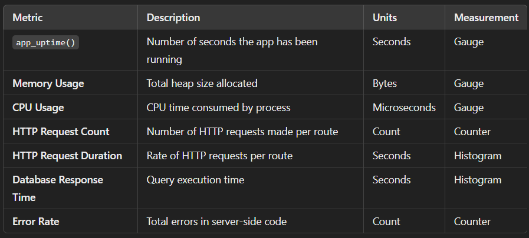
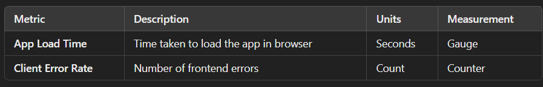
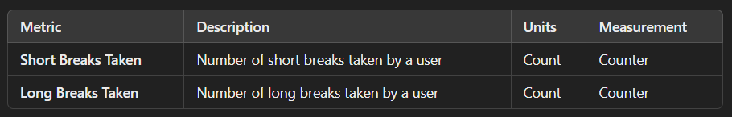
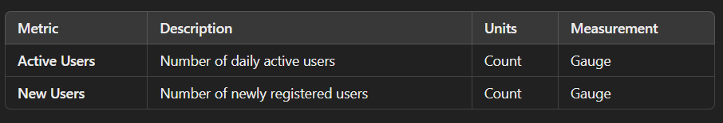
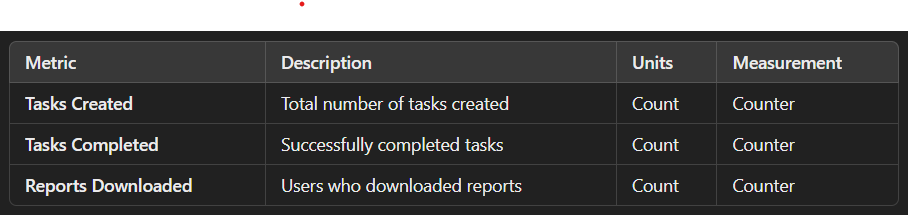

# Pomodoro Web Application
### Time Management Tool based on Pomodoro Application
--------------------------------------------------------------

----------------------------------------------------------------------------------------------------------------------------
### Overview
----------------------------------------------------------------------------------------------------------------------------
The Pomodoro Web Application is a productivity tool designed to help users manage their time effectively using the Pomodoro Technique. Built with the MERN stack (MongoDB, Express.js, React.js, Node.js), it enables users to create, track, and manage tasks seamlessly. The app includes observability features to monitor performance and troubleshoot issues efficiently.

----------------------------------------------------------------------------------------------------------------------------
### Techncial Aspects & Versions
----------------------------------------------------------------------------------------------------------------------------

#### 1. Technology Stack
    - Frontend: React.js
    - Backend: Node.js, Express.js
    - Database: MongoDB
    - State Management: React Context API
    - Authentication: JSON Web Token (JWT) - based authentication

#### 2. Observability and Monitoring Tools
The application incorporates observability tools for performance monitoring and debugging:

    - Logs: Winston Logger
    - Metrics: Prometheus
    - Traces: Jaeger (via OpenTelemetry)

#### 3. Debugging and Performance Monitoring
    - Browser Developer Tools (e.g., Inspect Browser Element)
    - OpenTelemetry for distributed tracing

#### Version Used
    - `node` - v22.14.0
    - `express.js` - 4.21.2
    - `react` - 18.3.1
    - `@opentelemetry/exporter-jaeger`: 1.24.1
    - `winston`: 3.13.0
    - `prom-client`: 14.2.0
    - `react-dom` - 18.3.1
    - `react-router-dom` - 6.23.0
    - `react-scripts` - 5.0.1
    - `booststrap.css` - 2.10.2
    - `react-markdown` - 10.1.0
    - `chart.js` - 4.4.2
    - `mongodb`: 6.14.2
    - `mongoose`: 8.12.0
    - `jsonwebtoken`: 9.0.2

----------------------------------------------------------------------------------------------------------------------------
### Application Usage
----------------------------------------------------------------------------------------------------------------------------
The Pomodoro App supports both guest and registered users:

    - Guest Users: Use Pomdoro Timer and Todo Task but cannot access Task List and Task Chart
    - Registered Users: Access `Task List` and `Task Chart` for detailed user analytics.


----------------------------------------------------------------------------------------------------------------------------
### Key Performance Indicators (KPIs)
----------------------------------------------------------------------------------------------------------------------------

#### 1. Application metrics
----------------------------




#### 2. Client-side metrics
----------------------------



#### 3. Session Management metrics
------------------------------------------



#### User Management Metrics
------------------------------



#### Tasks Metrics
--------------------------



----------------------------------------------------------------------------------------------------------------------------
### Installation Guide
----------------------------------------------------------------------------------------------------------------------------
#### Clone the repository

``` bash
git clone https://github.com/techiescamp/pomodoro-microservice.git
cd pomodoro-microservice
```
----------------------------------------------------------------------------------------------------------------------------
### Install dependencies
----------------------------------------------------------------------------------------------------------------------------
#### For Backend Pomodoro App

```bash
cd backend
npm install

// to run code
npm run dev (for development environment)
npm start (for production environment)
```

#### For backend Reports Service 

```bash
cd reports-service
npm install

// to run code
npm run dev (for development environment)
npm start (for production environment)
```

#### Frontend Pomdooro App

```bash
cd pomodoro-app
npm install

// to run code
npm start
```


---------------------------------------------------------------------------------------------------------------------------------
### Docker setup for "BACKEND"
---------------------------------------------------------------------------------------------------------------------------------

This repository provides instructions to build and run the backend service as a Docker container, using environment variables for configuration.

---

#### Build Docker Image

Use the following command to build the Docker image:

```bash
docker build -t pomodoro-backend:1.0.0 .
```

#### .env file content

Create a .env file with the following content:

```bash
PORT=7000
BASE_URL=http://localhost:3000
REPORTS_URL=http://localhost:7070

JAEGER_TRACE_URI=http://52.43.65.153:30894

SESSION_SECRET=supersecret
JWT_SECRET=mysecret

MONGODB_URL=<mongodburl>
```
#### Details

- *PORT*: The port on which the backend service will run.
- *BASE_URL*: The base URL for the frontend service.
- *REPORTS_URL*: URL for the reports service.
- *JAEGER_TRACE_URI*: URL for Jaeger tracing (optional).
- *SESSION_SECRET*: Secret key for managing user sessions.
- *JWT_SECRET* : Secret key for signing and verifying JSON Web Tokens (JWTs).
- *MONGODB_URL*: The connection URL for your MongoDB database.


#### Run Docker Image

Run the Docker container using this command:

```bash
docker run -d -p 7000:7000 --env-file .env pomodoro-backend:1.0.0
```

If your *.env* file is located in another directory, specify the path like this:

```bash
docker run -d -p 7000:7000 --env-file /path/to/.env pomodoro-backend:1.0.0
```

#### Debugging Tips

If you want to verify that your .env file is properly formatted and loaded by the container. Use the following command:

```bash
docker exec -it <container-id> env
```

To check the logs use the following command:

```bash
docker logs <container-id>
```

-----------------------------------------------------------------------------------------------------------------------------
### Docker Setup - "Reports-Service" backend
-----------------------------------------------------------------------------------------------------------------------------

This repository provides instructions to build and run the report backend service as a Docker container, using environment variables for configuration.

---

#### Build Docker Image

Use the following command to build the Docker image:

```bash
docker build -t pomodoro-report-backend:1.0.0 .
```

#### .env file content

Create a .env file with the following content:

```bash
PORT=7070
MONGODB_URL=<mongodburl>
JAEGER_TRACE_URI=http://52.43.65.153:30894
```

#### Details

- *PORT*: The port on which the report backend service will run.
- *MONGODB_URL*: The connection URL for your MongoDB database.
- *JAEGER_TRACE_URI*: (Optional) URL for Jaeger tracing, if available.


#### Run Docker image

Run the Docker container using this command:

```bash
docker run -d -p 7070:7070 --env-file .env pomodoro-report-backend:1.0.0
```

If your *.env* file is located in another directory, specify the path like this:

```bash
docker run -d -p 7070:7070 --env-file /path/to/.env pomodoro-report-backend:1.0.0
```

#### Debugging Tips

If you want to verify that your .env file is properly formatted and loaded by the container. Use the following command:

```bash
docker exec -it <container-id> env
```

To check the logs use the following command:

```bash
docker logs <container-id>
```


-----------------------------------------------------------------------------------------------------------------------------
### Contributing
-----------------------------------------------------------------------------------------------------------------------------
We welcome contributions! Feel free to submit issues or open a pull request. Thank you for my team for being part of this journey in building the pomodoro application.


---------------------------------------------------------------------------------------------------------------------------
### License
---------------------------------------------------------------------------------------------------------------------------
This project is licensed under the MIT License. [LICENSE]


